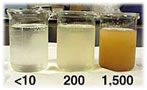
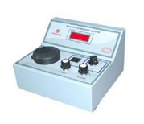
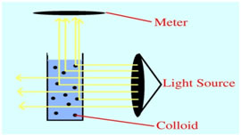
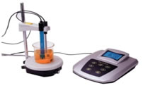
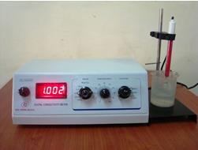

## Theory 

It is needless to emphasize the importance of water in our life. Without water, there is  no life on our planet.  We need water for different purposes. We need water for drinking, for industries, for irrigation, for swimming and fishing, etc. 

Water for different purposes has its own requirements as to composition and purity. Each body of water needs to be analysed on a regular basis to confirm to suitability. The types of analysis could vary from simple field testing for a single analyte to laboratory based multi-component instrumental analysis. The measurement of water quality is a very exacting and time consuming process, and a large number of quantitative analytical methods are used for this purpose.

 

### Turbidity:
 

Turbidity is the amount of particulate matter that is suspended in water. Turbidity measures the scattering effect that suspended solids have on light: the higher the intensity of scattered light, the higher the turbidity.

#### Material that causes water to be turbid includes:
 

- Clay.
- Silt.
- Finely divided organic and inorganic matter.
- Soluble coloured organic compounds.
- Plankton.
- Microscopic organisms.
 

The turbidity of sample solution can be measured by using Nephelometer. It is usually measured in nephelometric turbidity units (NTU) or Jackson turbidity units (JTU).

<h2>Principle:</h2>

    This method is based on a comparison of the intensity of light scattered by the sample under defined conditions 
    with the intensity of light scattered by a standard reference suspension under the same conditions. 
    The higher the intensity of scattered light, the higher the turbidity. 
    Commonly used primary standard reference suspension is Formazin polymer. 
    The turbidity of a specified concentration of formazin suspension is defined as 400 NTU. (w.1)

<h2>Interference:</h2>
<ul>
    <li>The presence of floating debris and coarse sediments will give high readings.</li>
    <li>Air bubbles will cause high results.</li>
    <li>Coloured samples will cause low results.</li>
</ul>

<h2>Apparatus:</h2>

    Laboratory or process nephelometer consisting of a light source for illuminating the sample and one or more 
    photoelectric detectors with a readout device to indicate intensity of light scattered at 90º to the path of incident light.

    <strong>Sample cells:</strong> Use sample cells or tubes of clear, colourless glass or plastic. 
    Keep cells scrupulously clean, both inside and out, and discard if scratched or etched.

<h2>Reagents:</h2>

<h3>1. Dilution Water:</h3>

    High-purity water will cause some light scattering, which is detected by nephelometers as turbidity. 
    To obtain low-turbidity water for dilutions, nominal value 0.02 NTU, pass laboratory reagent-grade water 
    through a filter with pore size sufficiently small to remove essentially all particles larger than 0.1µm. 
    The usual membrane filter used for bacteriological examinations is not satisfactory. 
    Rinse collecting flask at least twice with filtered water and discard the next 200 mL.

<h3>2. Stock Primary Standard Formazin Suspension:</h3>

<h4>2.1 Solution (i):</h4>

    Dissolve 1g hydrazinesulphate (NH2)2.H2SO4 in distilled water and dilute to 100 mL in a volumetric flask.

<strong>[Caution:</strong> Hydrazine sulphate is a carcinogen; avoid inhalation, ingestion, and skin contact. Formazine suspensions can contain residual hydrazine sulphate.]

<h4>2.2 Solution (ii):</h4>

    Dissolve 10.0g hexamethylenetetramine, (CH2)6N4, in distilled water and dilute to 100 mL in a volumetric flask.

<h4>2.3 Preparation of 400 NTU Stock Suspension:</h4>

    In a flask, mix 5.0 mL solution (i) and 5.0 mL solution (ii). 
    Let stand for 24 hr at 25 ± 3ºC. This results in a 400-NTU suspension. 
    Transfer stock suspension into an amber glass or other UV-light-blocking bottle for storage. 
    Make dilutions from this stock suspension. The stock suspension is stable for up to 1 year when properly stored.

<h4>2.4 Dilute Turbidity Suspensions:</h4>

    Dilute 400 NTU primary standard suspensions with high-quality dilution water. 
    Prepare immediately before use and after use.

    Working standards can be prepared by dilution of the following quantities of the stock formazin turbidity suspension 
    (nominal 400 NTU) to 200 mL.

<table border="1" cellpadding="8" cellspacing="0">
  <thead>
    <tr>
      <th>Dilute to 200 mL</th>
      <th>Resultant NTU</th>
    </tr>
  </thead>
  <tbody>
    <tr>
      <td>10 mL</td>
      <td>20</td>
    </tr>
    <tr>
      <td>5 mL</td>
      <td>10</td>
    </tr>
    <tr>
      <td>2 mL</td>
      <td>4</td>
    </tr>
    <tr>
      <td>0.5 mL</td>
      <td>1</td>
    </tr>
    <tr>
      <td>0.2 mL</td>
      <td>0.4</td>
    </tr>
    <tr>
      <td>0.0 mL</td>
      <td>0</td>
    </tr>
  </tbody>
</table>

<h3>3. Secondary standards:</h3>

    Secondary standards are standards that the manufacturer has certified will give instrument calibration results 
    equivalent (within certain limits) to the results obtained when the instrument is calibrated with the primary standard, 
    i.e., the user-prepared formazin.

<h3>Procedure:</h3>

<strong>a) General measurement techniques:</strong> Proper measurement techniques are important in minimizing the effects 
of instrument variables, as well as stray light and air bubbles. Regardless of the instrument used, the measurement will be 
more accurate, precise, and repeatable if close attention is paid to proper measurement techniques.

<strong>b) Nephelometer calibration:</strong> Follow the manufacturer’s operating instructions. Run at least one standard 
in each instrument range to be used. Make certain the nephelometer gives stable readings in all sensitivity ranges used.

<strong>c) Measurement of turbidity:</strong> Gently agitate sample. Wait until air bubbles disappear and pour sample into 
cell. When possible, pour well-mixed sample into cell and immerse it in an ultrasonic bath for 1 to 2 seconds or apply vacuum 
degassing, causing complete bubble release. Read turbidity directly from instrument display.

<strong>d) Calibration of continuous turbidity monitors:</strong> Calibrate continuous turbidity monitors for low 
turbidities by determining turbidity of the water flowing out of them using a laboratory-model nephelometer. Or calibrate 
the instruments according to manufacturer’s instructions with formazin primary standard or appropriate secondary standard.

<h3>Turbidity</h3>
<table border="1" cellpadding="8" cellspacing="0">
  <thead>
    <tr>
      <th>Sample Type</th>
      <th>NTU</th>
    </tr>
  </thead>
  <tbody>
    <tr>
      <td>Drinking water</td>
      <td>Between 5 NTU &amp; 1 NTU</td>
    </tr>
    <tr>
      <td>Sea water</td>
      <td>Varies from 6–12 NTU</td>
    </tr>
  </tbody>
</table>

<h3>pH:</h3>

    pH may be measured accurately using a pH meter. The pH meter must be calibrated before making pH measurements. 
    For calibration, standard buffers of pH 4.00, 7.00 and 10.00 are used. pH of water indicates the hydrogen ion 
    concentration in water. The concept of pH was put forward by **Sorenson** in 1909. It is expressed as the logarithm 
    of the reciprocal of the hydrogen ion concentration in moles/litre at a given temperature. 
    While the alkalinity or acidity measures the total resistance to the pH change or buffering capacity, 
    the pH gives the hydrogen ion activity. The pH scale extends from 0 (very acidic) to 14 (very alkaline) 
    with 7 corresponding to exact neutrality at 25ºC. pH is used in the calculation of carbonate, bicarbonate and CO2, 
    corrosion, stability index, etc.

$$pH=-log([H^+])$$

Practically every phase of water supply and waste water treatment such as water softening, acid-base neutralization, coagulation, precipitation, disinfectant and corrosion control is pH dependent. The pH of a water sample measures its hydrogen ion concentration and indicates whether the sample is acidic, neutral or basic. 

 

### pH meter:

<h3>pH of Various Samples:</h3>

<table border="1" cellpadding="8" cellspacing="0" style="text-align: center;">
  <thead>
    <tr>
      <th>Samples</th>
      <th>pH</th>
    </tr>
  </thead>
  <tbody>
    <tr>
      <td>Tap water</td>
      <td>7</td>
    </tr>
    <tr>
      <td>Sea water</td>
      <td>Varies from 7.5 – 8.4</td>
    </tr>
    <tr>
      <td>Well water</td>
      <td>Varies from 6.5 – 8.5</td>
    </tr>
    <tr>
      <td>Distilled water</td>
      <td>5.8</td>
    </tr>
  </tbody>
</table>

<h3>Electrical Conductivity:</h3>

  Electrical conductivity (EC) is a measure of how conductive the water is to electrical current. 
  Greater the ion concentration, greater is the EC. Generally, higher the EC, higher is the total dissolved solids. 
  Electrical conductivity is an indirect measure for finding the total dissolved solids in a water body.

  To convert the electrical conductivity of a water sample 
  (<abbr title="micro Siemens per centimetre">μS/cm</abbr>) to the concentration of total dissolved solids (ppm), 
  the conductivity must be multiplied by a factor between 0.46 and 0.9 
  (depending on the unique mixture of the dissolved materials).

  A widely accepted conversion factor is 0.67:  
  <strong>TDS (ppm) = Conductivity (μS/cm) × 0.67</strong>

  The instrument used for measuring conductivity is a <strong>conductivity meter</strong>.

<h3>Reagents:</h3>

<ol>
  <li>
    <strong>Conductivity water:</strong> Any of several methods can be used to prepare reagent-grade water. 
    Conductivity should be small compared to the value being measured.
  </li>
  <li>
    <strong>Standard Potassium Chloride solution (KCl) 0.01 M:</strong> 
    Dissolve 745.6 mg anhydrous KCl in conductivity water and dilute to 1000 mL in a class A volumetric flask at 25ºC and store in a CO2-free atmosphere. 
    This is the standard reference solution, which at 25ºC has a conductivity of 1412 µS/cm. 
    It is satisfactory for most samples when the cell has a constant between 1 and 2 cm−1. 
    For other cell constants, use stronger or weaker KCl solutions listed in the table below. 
    Care must be taken when using KCl solutions less than 0.001 M, which can be unstable due to CO2 in pure water. 
    For low conductivity standards, Standard Reference Material 3190, with a certified conductivity of 25.0 µS/cm ±0.3 µS/cm, may be obtained from NIST. 
    Store in a glass-stoppered borosilicate glass bottle.
  </li>
</ol>

<h4>KCl Conductivity Table</h4>
<table border="1" cellpadding="8" cellspacing="0" style="text-align: center; margin: auto;">
  <thead>
    <tr>
      <th>KCl Concentration (M)</th>
      <th>Equivalent Conductivity (cm2Ω−1 equiv−1)</th>
      <th>Conductivity, κ (µS/cm)</th>
    </tr>
  </thead>
  <tbody>
    <tr><td>0</td><td>149.9</td><td>—</td></tr>
    <tr><td>0.0001</td><td>148.9</td><td>14.9</td></tr>
    <tr><td>0.0005</td><td>147.7</td><td>73.9</td></tr>
    <tr><td>0.001</td><td>146.9</td><td>146.9</td></tr>
    <tr><td>0.005</td><td>143.6</td><td>717.5</td></tr>
    <tr><td>0.01</td><td>141.2</td><td>1412</td></tr>
    <tr><td>0.02</td><td>138.2</td><td>2765</td></tr>
    <tr><td>0.05</td><td>133.3</td><td>6667</td></tr>
    <tr><td>0.1</td><td>128.9</td><td>12890</td></tr>
    <tr><td>0.2</td><td>124.0</td><td>24800</td></tr>
    <tr><td>0.5</td><td>117.3</td><td>58670</td></tr>
    <tr><td>1</td><td>111.9</td><td>111900</td></tr>
  </tbody>
</table>

<h3>Procedure:</h3>

<ol>
  <li>
    <strong>Determination of cell constant:</strong> 
    Rinse conductivity cell with at least three portions of 0.01 M KCl solution. Adjust temperature of fourth portion to 25.0º ±0.1ºC. 
    If a conductivity meter displays resistance, R (ohms), measure resistance of this portion and note temperature. 
    Compute cell constant, C:
      
    <code>C (cm−1) = (0.001412) × RKCl × [1 + 0.0191 × (t − 25)]</code> 
    where <em>RKCl</em> = measured resistance in ohms, and <em>t</em> = temperature in ºC.
      
    Conductivity meters often display conductivity directly. Commercial probes often contain a temperature sensor. 
    Rinse probe three times with 0.01 M KCl. Adjust the temperature compensation dial to 0.0191 ºC−1. 
    With the probe in the standard KCl solution, adjust to read 1412 µS/cm. 
    This procedure automatically adjusts the cell constant internal to the meter.
  </li>

  <li>
    <strong>Conductivity measurement:</strong> 
    Thoroughly rinse the cell with one or more portions of the sample. 
    Adjust the temperature of the final portion to about 25ºC. 
    Measure the resistance or conductivity of the sample and note the temperature to ±0.1ºC.
  </li>
</ol>

<h3>Values of Electrical Conductivity:</h3>

<table border="1" cellpadding="8" cellspacing="0" style="text-align: center; margin: auto;">
  <thead>
    <tr>
      <th>Sample</th>
      <th>Electrical Conductivity (µS/cm)</th>
    </tr>
  </thead>
  <tbody>
    <tr>
      <td>Totally pure water</td>
      <td>0.055</td>
    </tr>
    <tr>
      <td>Typical DI water</td>
      <td>0.1</td>
    </tr>
    <tr>
      <td>Distilled water</td>
      <td>0.5</td>
    </tr>
    <tr>
      <td>Raw water</td>
      <td>50–100</td>
    </tr>
    <tr>
      <td>Domestic "tap" water</td>
      <td>500–800</td>
    </tr>
    <tr>
      <td>Potable water (max)</td>
      <td>1055</td>
    </tr>
    <tr>
      <td>Sea water</td>
      <td>56,000</td>
    </tr>
    <tr>
      <td>Brackish water</td>
      <td>100,000</td>
    </tr>
  </tbody>
</table>

